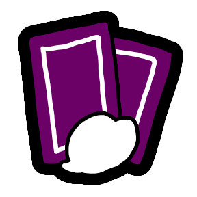
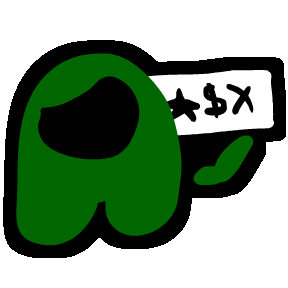
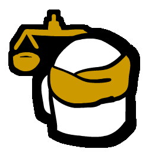
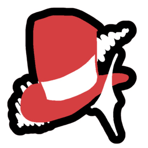
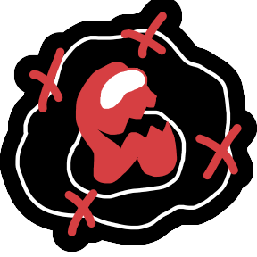
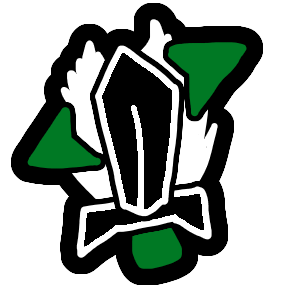
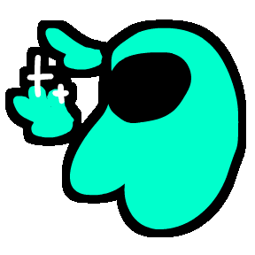
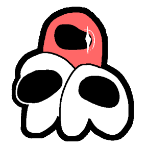

# Vigilante

  
  
  
  
  
  
  
  
  
  
  
  
  
  
  
  
  
  
  
  
  
  
  
  
  
  
  
  
  
  
  

## Known Bugs
- Venting right when Chameleon camouflage ends causes the user to be stuck in the vents... so don't do that

## Contributions & Credits

[MiraAPI](https://github.com/All-Of-Us-Mods/MiraAPI) - The primary framework of the mod\
[Endless Host Roles](https://github.com/Gurge44/EndlessHostRoles) - Decryptor\
[Reactor](https://github.com/NuclearPowered/Reactor) - Dependency for the mod\
[BepInEx](https://github.com/BepInEx) - For hooking game functions\
[Divani Mods](https://github.com/DivaniNL/TownOfUsMiraDivaniModsAddOn) - Code reference\
[TOU-Mira](https://github.com/AU-Avengers/TOU-Mira) - Code reference, mod framework\

espeon3 - Chameleon Role

## License
This software is distributed under the GNU GPLv3 License. BepInEx is distributed under the LGPL-2.1 License.

## Copyright

This mod is not affiliated with Among Us or Innersloth LLC, and the content contained therein is not endorsed or otherwise sponsored by Innersloth LLC. Portions of the materials contained herein are property of Innersloth LLC.

© Innersloth LLC.
